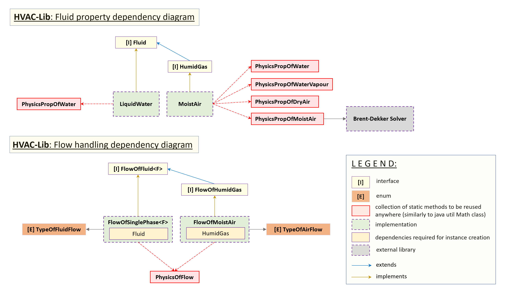
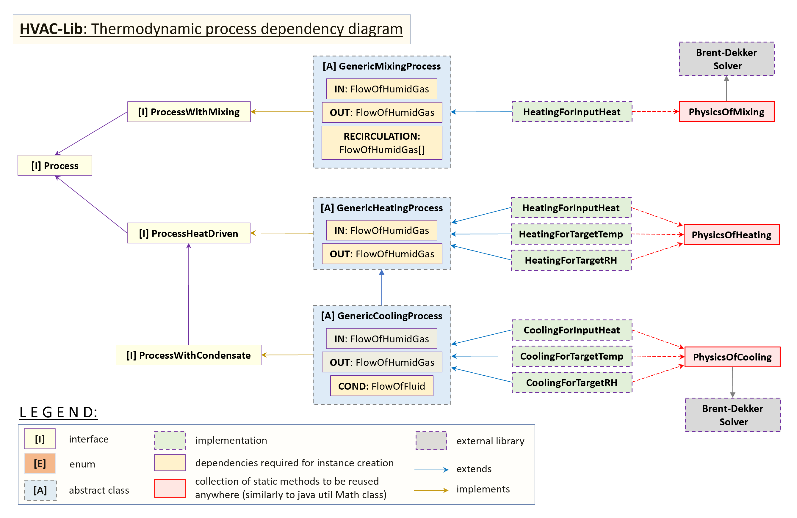

## HVAC-LIB - Psychrometrics Analysis Library <br> Thermodynamics of humid air for MEP/HVAC engineers

> VERSION: 1.1 - SNAPSHOT <br>
> AUTHOR: <b>Piotr Jażdżyk</b> <br>
> LINKEDIN: https://www.linkedin.com/in/pjazdzyk <br>

---

### [USER GUIDE](README_GUIDE.MD) &nbsp;|&nbsp; [FUNCTIONALITY](#functionality) &nbsp;|&nbsp; [LEGAL DISCLAIMER](#legal-disclaimer) &nbsp;|&nbsp; [UPCOMING](#upcoming-functionality) &nbsp;|&nbsp; [RESOURCES](#reference-sources)

---

HVAC-LIB is a set of libraries for moist air properties calculations including typical air thermodynamic processes in HVAC industry. The aim of this project is to create easy to use psychrometrics library, to be further 
used as an engine for any type of HVAC software development.
All output values are return as in basic SI units, with small exception to specific heat (kJ/kgK) instead of (J/kgK) and specific enthalpy is in (kJ/kg) instead of (J/kg). 

LAST CHANGES (2022.11.16):<br>
* all fluids, flows and processes classes are immutable for now on,
* all modules were heavily reworked and refactored implementing clean code rules where I managed to do it,
* Builder Pattern implemented in all key classes,
* changed packaging style to group all classes by domain, not by type,
* decoupled many dependencies by use of interfaces,
* split large classes into smaller pieces, to enforce SRP where possible,
* replaced many short physical property abbreviations with full names, for ie: "density" instead of "rho", with exception to Physics classes.
* added diagrams for better understanding all dependencies and key components

The library is organized into following modules:
* _fluids module_ - includes classes dedicated to fluid property representation and calculation
* _flows module_ - includes classes representing fluid or humid gas flow handling<br>

<a href="https://github.com/pjazdzyk/hvac-lib/blob/main/architecture/ARCH_1_FluidAndFlow.png"><br></a>

* _process module_ - includes classes representing each thermodynamic process implemented so far in the library<br>

<a href="https://github.com/pjazdzyk/hvac-lib/blob/main/architecture/ARCH_2_Process.png"><br></a>

* _tests_ - includes all tests representing how to properly use each of library components

## TECH
 &nbsp;
 &nbsp;
 &nbsp;

## FUNCTIONALITY

#### Moist air thermophysical properties:
* atmospheric pressure based on height above sea level,
* temperature change based on height above sea level,
* water vapour saturation pressure,
* dew point temperature and wet bulb temperature,
* air relative humidity,
* humidity ratio and maximum humidity ratio,
* kinematic and dynamic viscosity,
* thermal conductivity,
* specific enthalpy of humid air with water mist and ice mist components,
* specific heat,
* density,
* thermal diffusivity,
* Prandtl number.

#### Liquid water properties:
* specific heat,
* density,
* specific enthalpy.

#### Physics of flow:
* each FlowOfMoistAir instance stores moist air volumetric flow, moist air mass flow, dry air volumetric flow, and dry air mass flow.
* each flow type depends on aggregated MoistAir instance and flows are adjusted if the temperature or humidity changes,
* option to lock one selected flow type
* setting value one type of flow will automatically recalculate others, based on provided input value and current properties of the moist air

#### Air heating and cooling with condensate discharge:
* heating & cooling process driven by heat input / output,
* heating & cooling process driven by target outlet temperature,
* heating & cooling process driven by target relative humidity,

#### Air stream mixing:
* simple mixing of two flows with humidity content,
* mixing of multiple flows with humidity content,
* mixing algorithm which will try to adjust inlet and recirculation flow accordingly, to meet target output dry air mass flow and target outlet temperature.

## LEGAL DISCLAIMER
This code is my intellectual property. Please have respect for this. You can use it freely in any academic or non-commercial use if you
properly include the source and author in your references or documentation. For commercial use, please contact me first to discuss the license fee.

## PHYSICS NAMING CONVENTION
Naming style in Physics classes is shortened. Typical property abbreviations are used, matching this popular occurrence in technical scripts or literature.
Please find the example below:
```
calcMaTaTdpRH(){}
```
- a first fragment - "calc": stands for calculation type method of a given property. "Set" is for setters, "get" for getters.
- a second fragment - next part is a type of fluid: Ma - moist air, Da - dry air, Wv - water vapour, Wt - water
- a third fragment - is a name of variable returned by this function, Ta means that this function outputs air temperature as the result,
- a fourth part - are the variables needed as an input.

The approach presented above, which probably may cause a serious headache to any professional programmer, helps me organize all methods into a clear
structure, where corresponding methods are sorting themselves while writing a code using this library.

## UPCOMING FUNCTIONALITY
1. Service layer for easier objects creation and for increased module encapsulation,
2. REST API for humid air properties,
3. CSV Table generators for creating user-custom tables with requested properties value range
4. Module for water spray air humidification
5. Module for superheated steam air humidification
6. Module for simplified heat and humid recovery exchanger
7. Unit conversion system

Do you have a special request what this library should do to help you in your calculations? Just let me know!

## REFERENCE SOURCES

Each physical property has provided a reference source as well as the argument limit range for which the result is still reliable. There are also several methods allowing for calculations of some properties if others are available.
All methods accept arguments and output results in SI units. However, please read method java-doc to make sure that you are aware of what unit output value is represented. Some properties for example specific enthalpy,
outputs in kJ/kgK not in J/kgK.

AIR AND WATER VAPOUR PROPERTIES:
* [1] - ASHRAE FUNDAMENTALS 2002, CHAPTER 6 "Psychrometrics"
* [2] - Buck, Arden L. "New Equations for Computing Vapour Pressure and Enhancement Factor". Journal of Applied Meteorology and Climatology (December 1981).
* [3] - Buck Research Instruments L.L.C. "MODEL CR-1A HYGROMETER WITH AUTO FILL OPERATING MANUAL" (May 2012).
* [4] - Morvay Z.K, Gvozdenac D.D. "Fundamentals for analysis and calculation of energy and environmental performance". Applied Industrial Energy And Environmental Management.
* [5] - Lipska B. "Projektowanie Wentylacji i Klimatyzacji. Podstawy uzdatniania powietrza" Wydawnictwo Politechniki Śląskiej (Gliwice  2014).
* [6] - https://www.engineeringtoolbox.com
* [7] - Stull R. "Wet-Bulb Temperature from Relative Humidity and Air Temperature". Manuscript received 14 July 2011, in final form 28 August 2011
* [8] - Tsilingiris P.T "Thermophysical and transport properties of humid air at temperature range between 0 and 100oC". Elsevier, Science Direct (September 2007)
* [9] - E.W. Lemmon, R.T. Jacobsen, S.G. Penoncello, D. Friend. Thermodynamic Properties of Air and Mixtures of Nitrogen, Argon, and Oxygen from 60 to 2000 K at Pressures to 2000 MPa. J. Phys. Chem. Ref. Data, Vol. 29, No. 3, (2000)
* [10] - M. Wanielista, R. Kersten,  R. Eaglin. "Hydrology Water Quantity and Quality Control. 2nd ed." (1997).

LIQUID WATER PROPERTIES:
* [1] - F.E. Jones, G.L. Harris. ITS-90 Density of water formulation for volumetric standards' calibration. Journal of Research of the National Institute of Standards and Technology (1992)
* [2] - Water specific heat tables: https://www.engineeringtoolbox.com/specific-heat-capacity-water-d_660.html